# CVLite — Resume Studio

**Privacy-first · Offline · Bilingual · PDF-ready**

> [فارسی](#فارسی) · [English](#english)

### ▶ Live demo — <https://cvlite.mahmadkhanloo.workers.dev>

Hosted free on Cloudflare (accessible from inside Iran). See [DEPLOY.md](DEPLOY.md) to host your own.

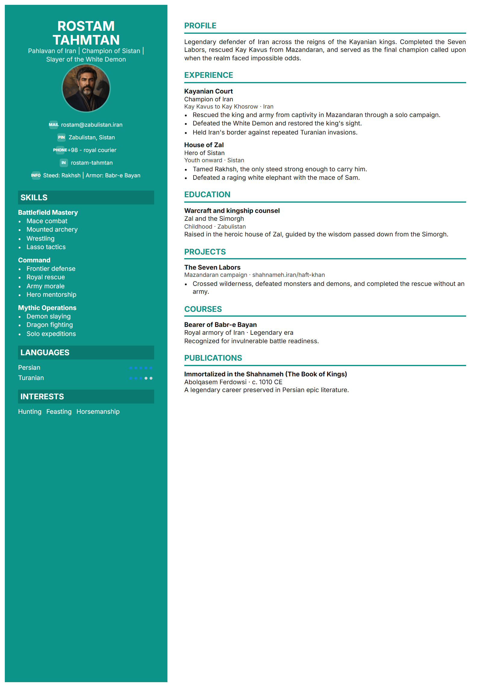

> The main preview features **Rostam-e Dastan** from Ferdowsi's *Shahnameh*.
> The gallery below renders every template with a different Shahnameh character.

---

## Template Gallery

All ten templates, each rendered with a Shahnameh-inspired résumé:

| Technical Sidebar<br>Rostam Tahmtan | Corporate Classic<br>Gordafarid | Compact Professional<br>Sohrab | Modern Minimal<br>Siavash |
|:---:|:---:|:---:|:---:|
| 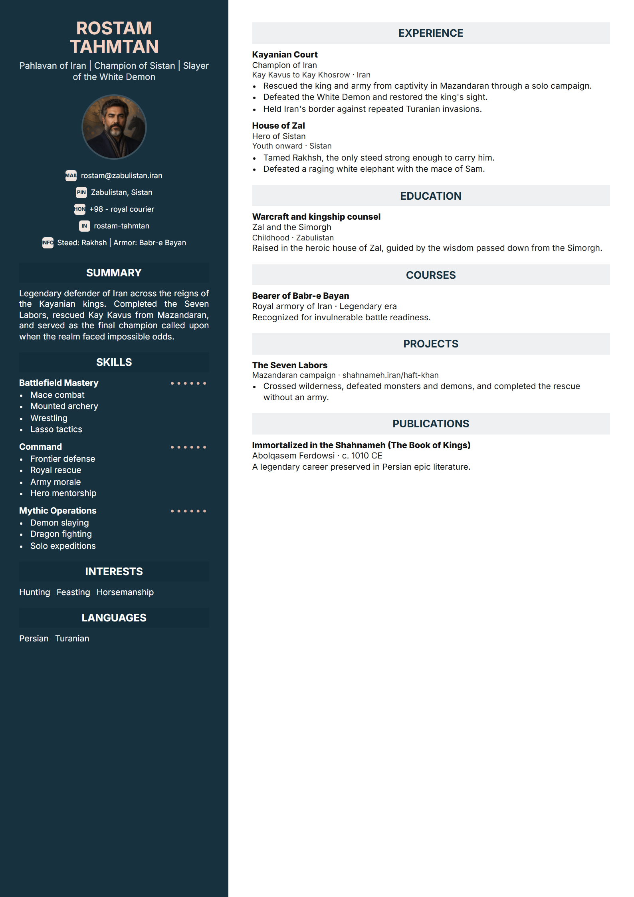 | 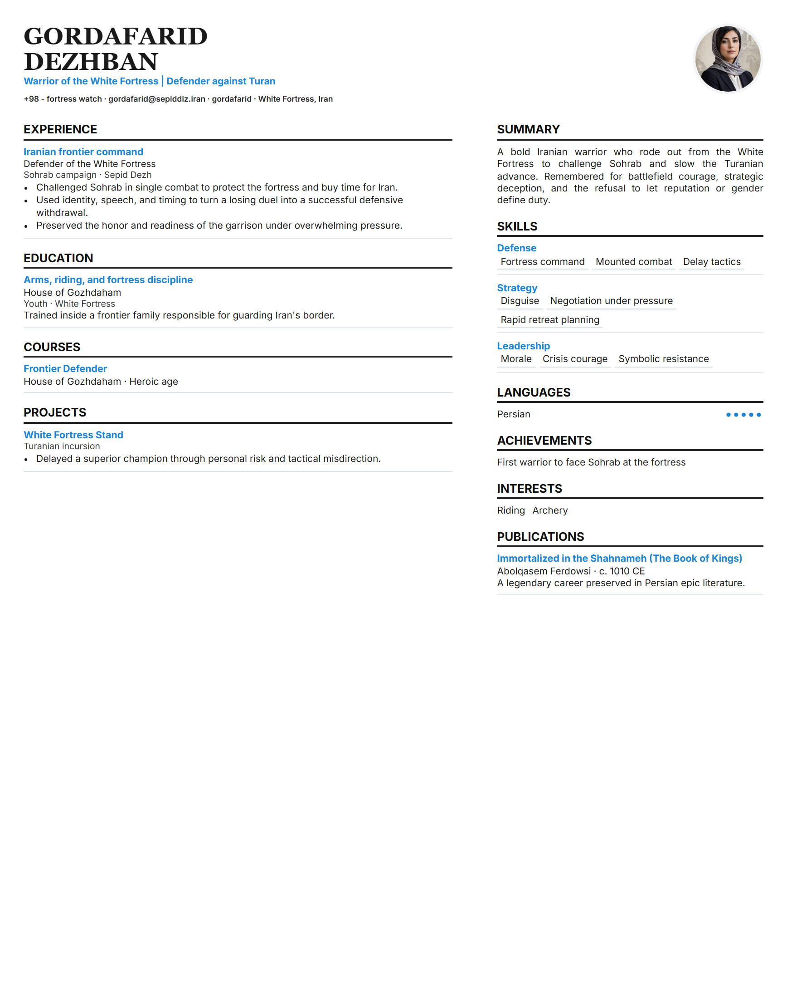 | 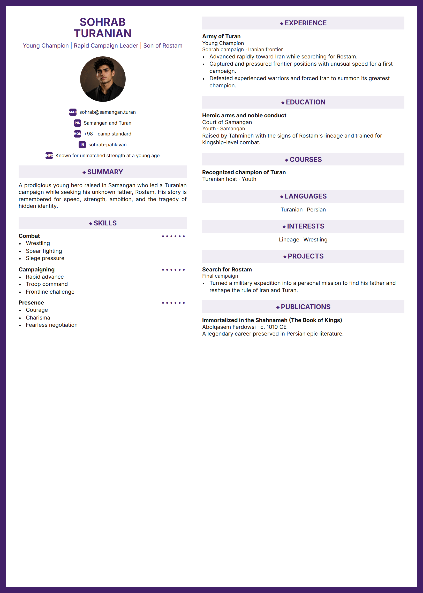 | 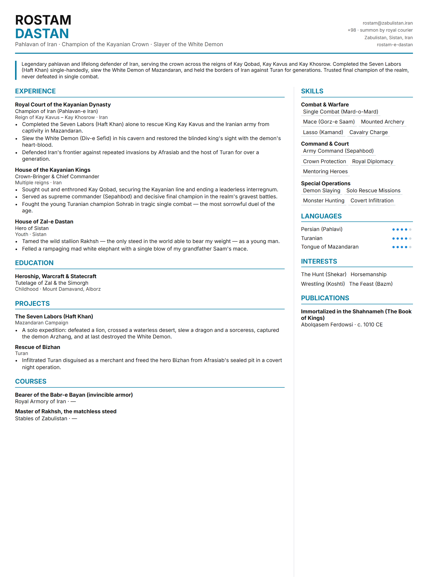 |
| **Executive Leadership**<br>Esfandiar | **Product & Design**<br>Rudabeh | **Creative Editorial**<br>Tahmineh | **ATS Plain Text**<br>Afrasiab |
| 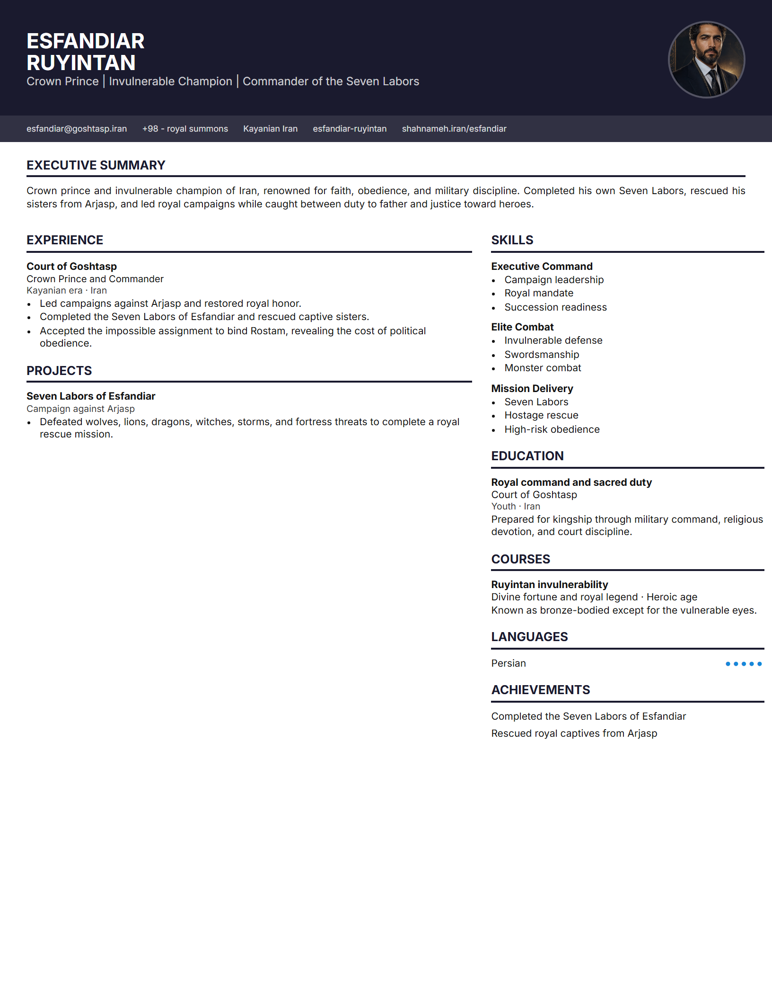 | 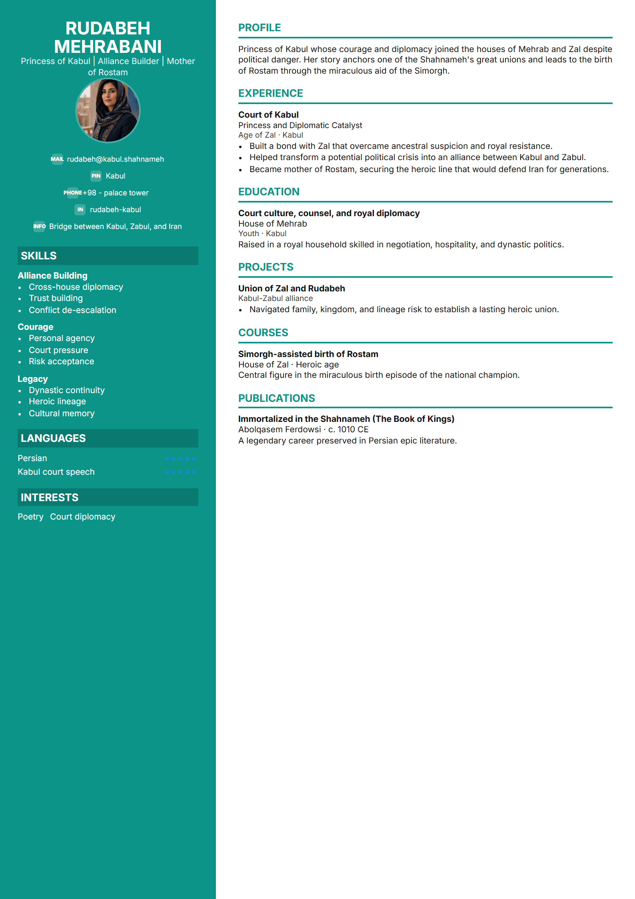 | 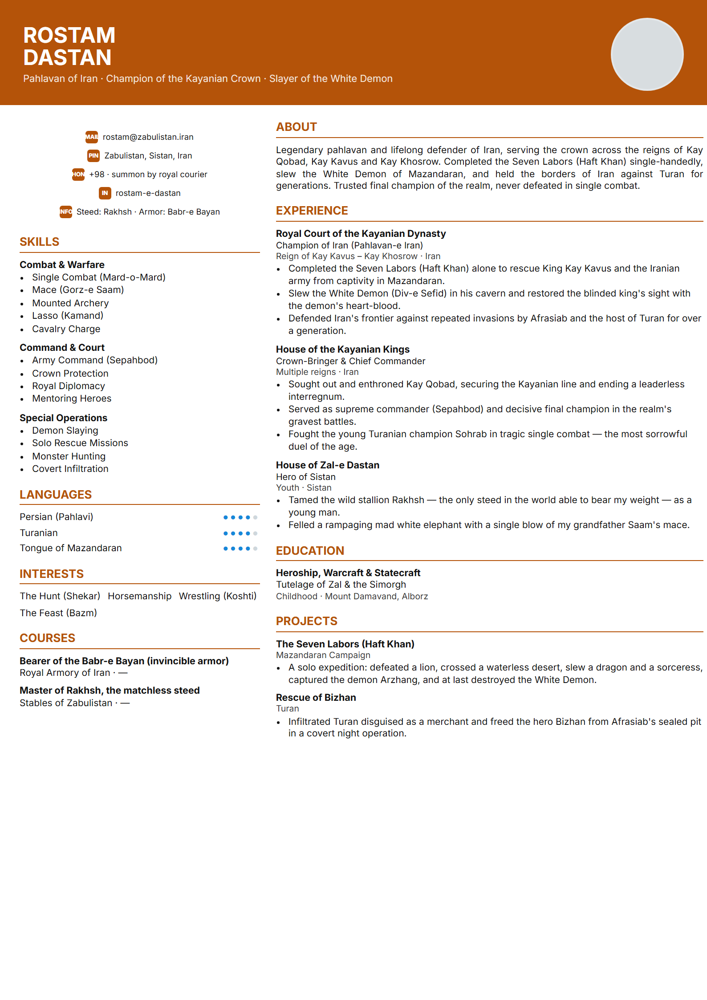 | 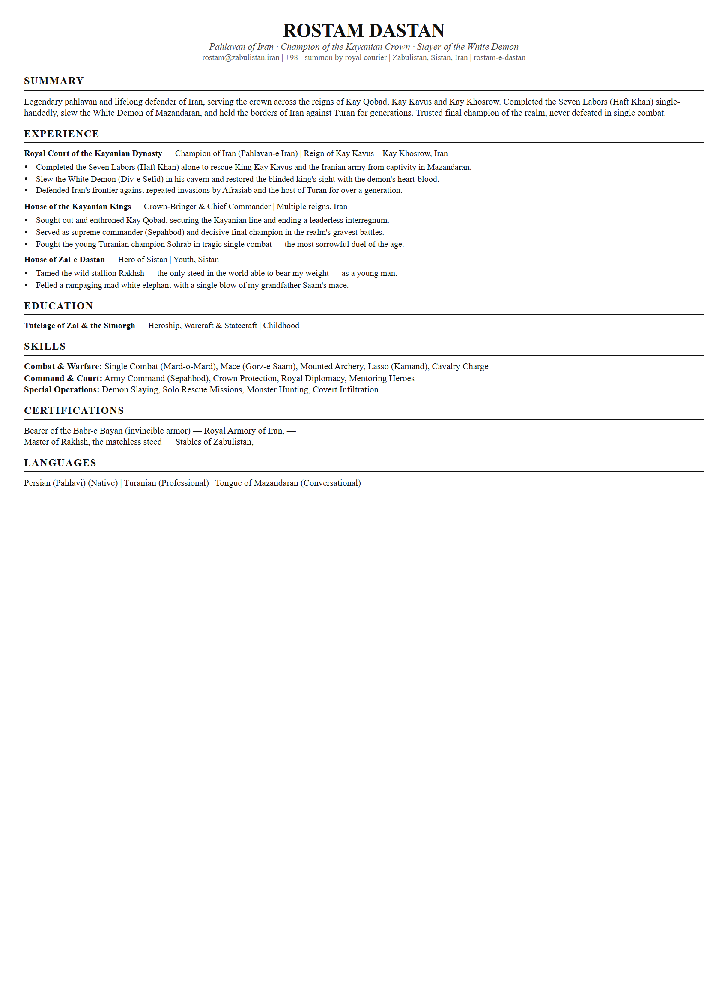 |
| **Gordafarid Defender**<br>Gordafarid | **Rudabeh Heritage**<br>Rudabeh |  |  |
| 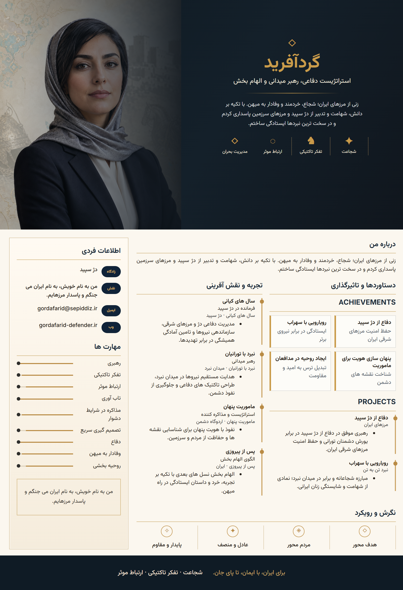 | 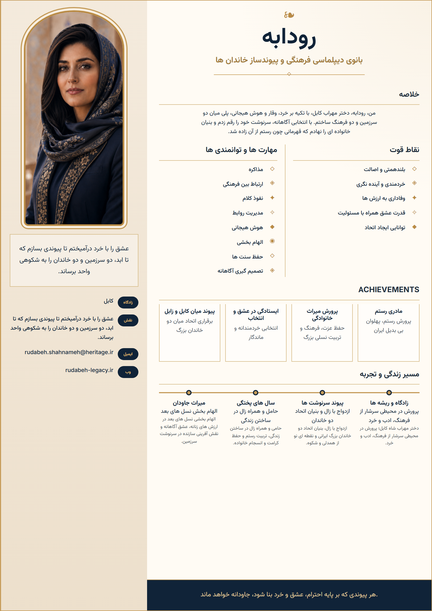 |  |  |

---

## English

CVLite is a fully offline, browser-based resume builder. All data stays in your browser — nothing is sent to any server. Export to PDF, JSON, or Markdown in seconds.

### Quick Start

```bash
# 1. Install dependencies
npm ci

# 2. Build & run (serves the app + PDF export)
npm start
```

Open **http://127.0.0.1:4173** in Edge or Chrome.

> **Dev mode** (with hot-reload):
> ```bash
> npm run dev        # Vite dev server → http://localhost:5173
> npm run serve      # PDF server (open in a second terminal)
> ```

### Features

- **100% offline** — fonts, assets, everything bundled locally
- **10 resume templates** — Technical Sidebar, Corporate Classic, Compact Professional, Modern Minimal, Executive Leadership, Product & Design, Creative Editorial, ATS Plain Text, Gordafarid Defender, Rudabeh Heritage
- **Import** `.json` / `.md` / `.markdown` files
- **Export** PDF (via headless Chrome/Edge), JSON, Markdown
- **Drag & drop** reordering of all sections
- **Photo upload** with auto square-crop
- **Bilingual UI** — English & Persian (Farsi) with RTL support
- **Light / Dark / System** theme
- **Auto-save** to browser storage — no account needed
- Custom sections, achievements, publications, languages, interests, certifications

### Templates

| Template | Style |
|---|---|
| Technical Sidebar | Dense two-column layout for engineering and technical roles |
| Corporate Classic | Traditional profile-first resume for corporate applications |
| Compact Professional | Space-efficient layout for concise one-page resumes |
| Modern Minimal | Clean editorial structure for general professional use |
| Executive Leadership | Polished leadership format for senior and management roles |
| Product & Design | Balanced sidebar resume for product, design, and hybrid roles |
| Creative Editorial | Warm visual layout for creative and storytelling-heavy profiles |
| ATS Plain Text | Plain, parser-friendly structure for applicant tracking systems |
| Gordafarid Defender | Dark/gold A4 layout with a large hero image, sidebar, experience, and achievement cards |
| Rudabeh Heritage | Decorative A4 layout with portrait/contact column, strengths, achievement cards, and timeline |

Template reference images live in `assets/templates/references/`; generated gallery previews live in `assets/templates/`.

### PDF Export

Real PDF export requires the Node server (`npm start` or `npm run serve`) and uses headless
Chrome/Edge. Static deployments can still export JSON/Markdown, but the PDF button needs the Node
PDF endpoint. To use a custom browser:

```powershell
$env:CVLITE_BROWSER = "C:\Path\To\chrome.exe"
npm start
```

### Sample Resume

Paste this JSON into CVLite via **Import → JSON**, then pick the **Product & Design** or **Executive Leadership** template.

```json
{
  "basics": {
    "firstName": "Rostam",
    "lastName": "Dastan",
    "headline": "Pahlavan of Iran · Champion of the Kayanian Crown · Slayer of the White Demon",
    "email": "rostam@zabulistan.iran",
    "phone": "+98 · summon by royal courier",
    "location": "Zabulistan, Sistan, Iran",
    "website": "https://shahnameh.iran",
    "linkedin": "rostam-e-dastan",
    "extra": "Steed: Rakhsh · Armor: Babr-e Bayan",
    "photo": ""
  },
  "summary": "Legendary pahlavan and lifelong defender of Iran, serving the crown across the reigns of Kay Qobad, Kay Kavus and Kay Khosrow. Completed the Seven Labors (Haft Khan) single-handedly, slew the White Demon of Mazandaran, and held the borders of Iran against Turan for generations. Trusted final champion of the realm, never defeated in single combat.",
  "skills": [
    {
      "id": "s1", "hidden": false,
      "name": "Combat & Warfare",
      "level": "",
      "keywords": ["Single Combat (Mard-o-Mard)", "Mace (Gorz-e Saam)", "Mounted Archery", "Lasso (Kamand)", "Cavalry Charge"]
    },
    {
      "id": "s2", "hidden": false,
      "name": "Command & Court",
      "level": "",
      "keywords": ["Army Command (Sepahbod)", "Crown Protection", "Royal Diplomacy", "Mentoring Heroes"]
    },
    {
      "id": "s3", "hidden": false,
      "name": "Special Operations",
      "level": "",
      "keywords": ["Demon Slaying", "Solo Rescue Missions", "Monster Hunting", "Covert Infiltration"]
    }
  ],
  "experience": [
    {
      "id": "e1", "hidden": false,
      "title": "Champion of Iran (Pahlavan-e Iran)",
      "organization": "Royal Court of the Kayanian Dynasty",
      "location": "Iran",
      "period": "Reign of Kay Kavus – Kay Khosrow",
      "bullets": [
        "Completed the Seven Labors (Haft Khan) alone to rescue King Kay Kavus and the Iranian army from captivity in Mazandaran.",
        "Slew the White Demon (Div-e Sefid) in his cavern and restored the blinded king's sight with the demon's heart-blood.",
        "Defended Iran's frontier against repeated invasions by Afrasiab and the host of Turan for over a generation."
      ]
    },
    {
      "id": "e2", "hidden": false,
      "title": "Crown-Bringer & Chief Commander",
      "organization": "House of the Kayanian Kings",
      "location": "Iran",
      "period": "Multiple reigns",
      "bullets": [
        "Sought out and enthroned Kay Qobad, securing the Kayanian line and ending a leaderless interregnum.",
        "Served as supreme commander (Sepahbod) and decisive final champion in the realm's gravest battles.",
        "Fought the young Turanian champion Sohrab in tragic single combat — the most sorrowful duel of the age."
      ]
    },
    {
      "id": "e3", "hidden": false,
      "title": "Hero of Sistan",
      "organization": "House of Zal-e Dastan",
      "location": "Sistan",
      "period": "Youth",
      "bullets": [
        "Tamed the wild stallion Rakhsh — the only steed in the world able to bear my weight — as a young man.",
        "Felled a rampaging mad white elephant with a single blow of my grandfather Saam's mace."
      ]
    }
  ],
  "education": [
    {
      "id": "ed1", "hidden": false,
      "degree": "Heroship, Warcraft & Statecraft",
      "organization": "Tutelage of Zal & the Simorgh",
      "location": "Mount Damavand, Alborz",
      "period": "Childhood",
      "gpa": "Blessed by the Simorgh",
      "bullets": ["Raised and counseled through the wisdom of the mythical Simorgh, conveyed by my father Zal."]
    }
  ],
  "projects": [
    {
      "id": "p1", "hidden": false,
      "name": "The Seven Labors (Haft Khan)",
      "url": "https://shahnameh.iran/haft-khan",
      "period": "Mazandaran Campaign",
      "bullets": [
        "A solo expedition: defeated a lion, crossed a waterless desert, slew a dragon and a sorceress, captured the demon Arzhang, and at last destroyed the White Demon."
      ]
    },
    {
      "id": "p2", "hidden": false,
      "name": "Rescue of Bizhan",
      "url": "",
      "period": "Turan",
      "bullets": [
        "Infiltrated Turan disguised as a merchant and freed the hero Bizhan from Afrasiab's sealed pit in a covert night operation."
      ]
    }
  ],
  "certifications": [
    {
      "id": "c1", "hidden": false,
      "title": "Bearer of the Babr-e Bayan (invincible armor)",
      "issuer": "Royal Armory of Iran",
      "date": "—"
    },
    {
      "id": "c2", "hidden": false,
      "title": "Master of Rakhsh, the matchless steed",
      "issuer": "Stables of Zabulistan",
      "date": "—"
    }
  ],
  "languages": [
    { "id": "l1", "hidden": false, "language": "Persian (Pahlavi)", "fluency": "Native" },
    { "id": "l2", "hidden": false, "language": "Turanian", "fluency": "Professional" },
    { "id": "l3", "hidden": false, "language": "Tongue of Mazandaran", "fluency": "Conversational" }
  ],
  "interests": [
    { "id": "i1", "hidden": false, "name": "The Hunt (Shekar)" },
    { "id": "i2", "hidden": false, "name": "Horsemanship" },
    { "id": "i3", "hidden": false, "name": "Wrestling (Koshti)" },
    { "id": "i4", "hidden": false, "name": "The Feast (Bazm)" }
  ],
  "publications": [
    { "id": "pub1", "hidden": false, "title": "Immortalized in the Shahnameh (The Book of Kings)", "publisher": "Abolqasem Ferdowsi", "date": "c. 1010 CE" }
  ],
  "achievements": [
    { "id": "a1", "hidden": false, "title": "Slayer of the White Demon of Mazandaran" },
    { "id": "a2", "hidden": false, "title": "Undefeated in single combat for a lifetime" },
    { "id": "a3", "hidden": false, "title": "Champion across the reigns of five kings" }
  ],
  "customSections": []
}
```

---

## فارسی

CVLite یک رزومه‌ساز کاملاً آفلاین و مبتنی بر مرورگر است. تمام اطلاعات شما فقط در مرورگرتان ذخیره می‌شود — هیچ چیزی به هیچ سروری ارسال نمی‌شود. در چند ثانیه خروجی PDF، JSON یا Markdown بگیرید.

### راه‌اندازی سریع

```bash
# ۱. نصب وابستگی‌ها
npm ci

# ۲. ساخت و اجرا (اپ + خروجی PDF)
npm start
```

آدرس **http://127.0.0.1:4173** را در Edge یا Chrome باز کنید.

> **حالت توسعه** (با hot-reload):
> ```bash
> npm run dev        # سرور Vite → http://localhost:5173
> npm run serve      # سرور PDF (در ترمینال دوم اجرا کنید)
> ```

### قابلیت‌ها

- **۱۰۰٪ آفلاین** — فونت‌ها، دارایی‌ها و همه چیز داخل پروژه است
- **۱۰ قالب رزومه** — Technical Sidebar، Corporate Classic، Compact Professional، Modern Minimal، Executive Leadership، Product & Design، Creative Editorial، ATS Plain Text، Gordafarid Defender، Rudabeh Heritage
- **ایمپورت** فایل‌های `.json` / `.md` / `.markdown`
- **خروجی** PDF (از طریق Chrome/Edge headless)، JSON، Markdown
- **جابه‌جایی با کشیدن** برای تمام بخش‌ها
- **آپلود عکس** با crop خودکار مربعی
- **رابط کاربری دوزبانه** — فارسی و انگلیسی با پشتیبانی RTL
- **تم** روشن / تیره / مطابق سیستم
- **ذخیره خودکار** در مرورگر — بدون نیاز به حساب کاربری
- بخش‌های سفارشی، دستاوردها، انتشارات، زبان‌ها، علایق، گواهینامه‌ها

### قالب‌ها

| قالب | سبک |
|---|---|
| Technical Sidebar | چیدمان دو ستونه و فشرده برای نقش‌های فنی و مهندسی |
| Corporate Classic | رزومه کلاسیک و رسمی برای موقعیت‌های شرکتی |
| Compact Professional | قالب کم‌حجم برای رزومه‌های یک‌صفحه‌ای |
| Modern Minimal | ساختار تمیز و مینیمال برای استفاده عمومی حرفه‌ای |
| Executive Leadership | قالب رسمی برای مدیران و نقش‌های ارشد |
| Product & Design | چیدمان متعادل برای محصول، طراحی و نقش‌های ترکیبی |
| Creative Editorial | قالب گرم و روایی برای پروفایل‌های خلاق |
| ATS Plain Text | ساختار ساده و مناسب سیستم‌های ATS |
| Gordafarid Defender | قالب A4 تیره/طلایی با هدر تصویری بزرگ، ستون کناری، تجربه و کارت‌های دستاورد |
| Rudabeh Heritage | قالب A4 تزئینی با ستون پرتره/تماس، نقاط قوت، کارت‌های دستاورد و timeline |

تصویرهای reference در `assets/templates/references/` هستند و previewهای ساخته‌شده‌ی gallery در `assets/templates/` قرار می‌گیرند.

### خروجی PDF

خروجی PDF واقعی به سرور Node نیاز دارد (`npm start` یا `npm run serve`) و با Chrome/Edge
headless ساخته می‌شود. deploy استاتیک همچنان خروجی JSON/Markdown دارد، اما دکمه PDF به endpoint
سرور Node نیاز دارد. برای استفاده از مرورگر دلخواه:

```powershell
$env:CVLITE_BROWSER = "C:\Path\To\chrome.exe"
npm start
```

### نمونه رزومه

این JSON را از طریق **Import → JSON** وارد CVLite کنید، سپس قالب **Product & Design** یا **Executive Leadership** را انتخاب کنید.

```json
{
  "basics": {
    "firstName": "رستم",
    "lastName": "دستان",
    "headline": "پهلوان ایران · جهان‌پهلوان دربار کیانی · کشندهٔ دیو سپید",
    "email": "rostam@zabulistan.iran",
    "phone": "با پیک شاهی احضار شود",
    "location": "زابلستان، سیستان، ایران",
    "website": "https://shahnameh.iran",
    "linkedin": "rostam-e-dastan",
    "extra": "اسب: رخش · زره: ببر بیان",
    "photo": ""
  },
  "summary": "جهان‌پهلوان و نگهبان همیشگی ایران؛ خدمتگزار تاج کیانی در روزگار کیقباد، کیکاوس و کیخسرو. هفت‌خوان را تنها به‌انجام رساند، دیو سپید مازندران را کشت و مرزهای ایران را نسل‌اندرنسل در برابر توران نگه داشت. واپسین پهلوان قابل‌اعتماد کشور؛ در نبرد تن‌به‌تن هرگز شکست نخورد.",
  "skills": [
    {
      "id": "s1", "hidden": false,
      "name": "رزم و جنگاوری",
      "level": "",
      "keywords": ["نبرد تن‌به‌تن", "گرز سام", "تیراندازی سواره", "کمند", "یورش سواره‌نظام"]
    },
    {
      "id": "s2", "hidden": false,
      "name": "فرماندهی و دربار",
      "level": "",
      "keywords": ["سپهبدی", "پاسداری از تاج", "دیپلماسی شاهی", "پرورش پهلوانان"]
    },
    {
      "id": "s3", "hidden": false,
      "name": "عملیات ویژه",
      "level": "",
      "keywords": ["دیوکشی", "نجات تک‌نفره", "شکار هیولا", "نفوذ پنهان"]
    }
  ],
  "experience": [
    {
      "id": "e1", "hidden": false,
      "title": "پهلوان ایران (جهان‌پهلوان)",
      "organization": "دربار دودمان کیانی",
      "location": "ایران",
      "period": "روزگار کیکاوس تا کیخسرو",
      "bullets": [
        "هفت‌خوان را تنها پیمود تا کیکاوس و سپاه ایران را از اسارت در مازندران برهاند.",
        "دیو سپید را در غارش کشت و با خون جگر او بینایی شاه نابینا را بازگرداند.",
        "بیش از یک نسل، مرز ایران را در برابر یورش‌های پیاپی افراسیاب و سپاه توران نگاه داشت."
      ]
    },
    {
      "id": "e2", "hidden": false,
      "title": "تاج‌بخش و سرفرمانده",
      "organization": "خاندان شاهان کیانی",
      "location": "ایران",
      "period": "چند پادشاهی",
      "bullets": [
        "کیقباد را یافت و بر تخت نشاند و دودمان کیانی را از بی‌سروری رهاند.",
        "سپهبد بزرگ و پهلوان نهاییِ سرنوشت‌سازِ کشور در سخت‌ترین نبردها بود.",
        "با سهراب، پهلوان جوان تورانی، در غم‌بارترین نبرد تن‌به‌تن روزگار جنگید."
      ]
    },
    {
      "id": "e3", "hidden": false,
      "title": "پهلوان سیستان",
      "organization": "خاندان زالِ دستان",
      "location": "سیستان",
      "period": "جوانی",
      "bullets": [
        "رخش، اسب وحشی، را در جوانی رام کرد — تنها اسبی که توان کشیدن بار او را داشت.",
        "پیل سرکش و دیوانه‌ای را با یک ضربهٔ گرز نیای خود، سام، از پای درآورد."
      ]
    }
  ],
  "education": [
    {
      "id": "ed1", "hidden": false,
      "degree": "پهلوانی، جنگاوری و کشورداری",
      "organization": "تربیت زال و سیمرغ",
      "location": "کوه دماوند، البرز",
      "period": "کودکی",
      "gpa": "مورد عنایت سیمرغ",
      "bullets": ["با خرد سیمرغ افسانه‌ای، به‌واسطهٔ پدرش زال، پرورش یافت و راهنمایی شد."]
    }
  ],
  "projects": [
    {
      "id": "p1", "hidden": false,
      "name": "هفت‌خوان رستم",
      "url": "https://shahnameh.iran/haft-khan",
      "period": "لشکرکشی مازندران",
      "bullets": [
        "سفری تک‌نفره: شیر را شکست داد، بیابان بی‌آب را گذراند، اژدها و جادوگر را کشت، دیو ارژنگ را گرفت و سرانجام دیو سپید را نابود کرد."
      ]
    },
    {
      "id": "p2", "hidden": false,
      "name": "نجات بیژن",
      "url": "",
      "period": "توران",
      "bullets": [
        "در لباس بازرگان به توران نفوذ کرد و بیژن را در عملیاتی پنهانی از چاه دربستهٔ افراسیاب رهانید."
      ]
    }
  ],
  "certifications": [
    {
      "id": "c1", "hidden": false,
      "title": "دارندهٔ ببر بیان (زره رویین‌تن)",
      "issuer": "زرادخانهٔ شاهی ایران",
      "date": "—"
    },
    {
      "id": "c2", "hidden": false,
      "title": "صاحب رخش، اسب بی‌همتا",
      "issuer": "اصطبل زابلستان",
      "date": "—"
    }
  ],
  "languages": [
    { "id": "l1", "hidden": false, "language": "پارسی (پهلوی)", "fluency": "زبان مادری" },
    { "id": "l2", "hidden": false, "language": "تورانی", "fluency": "حرفه‌ای" },
    { "id": "l3", "hidden": false, "language": "زبان مازندران", "fluency": "محاوره‌ای" }
  ],
  "interests": [
    { "id": "i1", "hidden": false, "name": "شکار" },
    { "id": "i2", "hidden": false, "name": "اسب‌سواری" },
    { "id": "i3", "hidden": false, "name": "کشتی" },
    { "id": "i4", "hidden": false, "name": "بزم" }
  ],
  "publications": [
    { "id": "pub1", "hidden": false, "title": "جاودانه در شاهنامه", "publisher": "ابوالقاسم فردوسی", "date": "حدود ۱۰۱۰ میلادی" }
  ],
  "achievements": [
    { "id": "a1", "hidden": false, "title": "کشندهٔ دیو سپید مازندران" },
    { "id": "a2", "hidden": false, "title": "شکست‌ناپذیر در نبرد تن‌به‌تن در سراسر عمر" },
    { "id": "a3", "hidden": false, "title": "پهلوان روزگار پنج پادشاه" }
  ],
  "customSections": []
}
```
